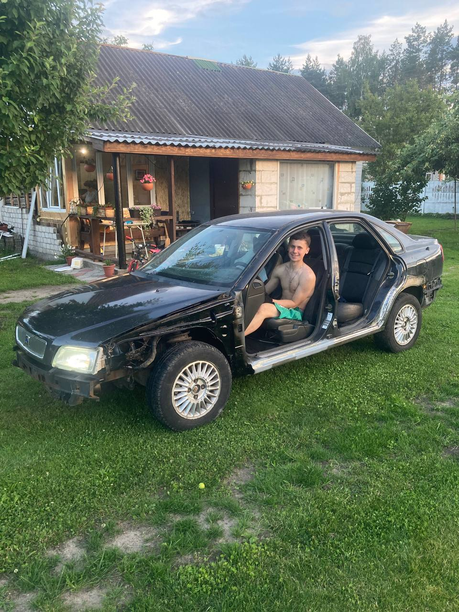

# Artsem Filimonyuk

## Engineer of Electrical Control & Instrumentation (EC&I engineer)

- **E-mail:** artemfilimonyuk@gmail.com    
- **Phone:** +375(29) 220-65-31
- **Telegram:** @filimonyuk.a
- **GitHub:** [github.com/filimonyuk-a](https://github.com/filimonyuk-a)

## About

_Hello, nice to meet you!_




I am an electrical control and automation engineer, looking to develop my technical knowledge and skills and apply them in practice in a variety of projects.

## Skills


- _Process automation_
- _Control systems design_
- _Programming in Python_
- _Interfaces for interacting with equipment_
- _Knowledge of automation standards and protocols_
- _NoSQL Databases (Hive, Isar, MongoDB)_
- _SQL Databases(SQLite, PostgreSQL)_
- _Work with APIs and HTTPs_
- _Git_
- _Get along with principles, patterns and clean code styles_
- _English_ - _B2 Level_


## Experience

### E-auto LLC (Eurooptavto LLC)
- _September 2023_ —
_April 2024
8 months_

- Electronics Technician
  My responsibilities included installing advanced GPS systems on a variety of trucks and cars, as
well as professionally restoring and updating wiring. In the course of my work, I successfully
operated the bitrix and wialon systems, using their functionality to ensure reliable communication
and effective monitoring. In addition, I carried out the connection and configuration of video
surveillance, providing customers with reliable and secure solutions for their vehicles.

### Atlant-M, an international automobile holding
- _March 2024_ —
_till now 
1 year_


Automotive Business
- Maintenance, Repairs of Automobiles
- Auto Components, Parts, Tires (Promotion, Wholesale)
- Car Retail (Dealer Center)
Autoelectrician
Job responsibilities include installing additional equipment on cars, diagnosing and repairing
electrical equipment, working with software for configuring car systems, maintaining
documentation and using specialized equipment.


### LLC "Melston-West", Minsk
- _March 2025_ —
_till now 
2 months_


Electromechanic / Mechanic  
- Ensured the seamless operation of electrical and mechanical systems.
- Conducted scheduled and emergency maintenance of equipment.
- Participated in the repair and modernization of mechanical components.
- Diagnosed and resolved malfunctions effectively.
- Engaged with clients and contractors in a field-based role.
- Adhered to safety regulations and occupational health standards.

## Education

| Years            | University        | Branch                |
| ---------------- | ----------------- | --------------------- |
| 2022 – This day  | BSUIR             | Systems Engineer      |

## Code example: QuickSort Algorithm 

```Dart
void quickSort(List<int> list, int low, int high) {
  if (low < high) {
    int pivotIndex = _partition(list, low, high);
    quickSort(list, low, pivotIndex - 1);
    quickSort(list, pivotIndex + 1, high);
  }
}

int _partition(List<int> list, int low, int high) {
  int pivot = list[high];
  int i = low - 1;

  for (int j = low; j < high; j++) {
    if (list[j] <= pivot) {
      i++;
      _swap(list, i, j);
    }
  }
  _swap(list, i + 1, high);
  return i + 1;
}

void _swap(List<int> list, int i, int j) {
  int temp = list[i];
  list[i] = list[j];
  list[j] = temp;
}

```

[Labworks preview](https://filimonyuk-a.github.io/EVT/)
